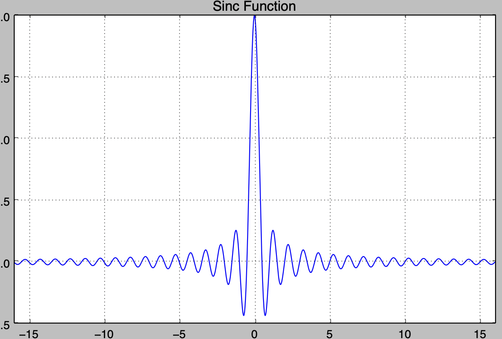

# Sample-Rate Conversion

## Digital Audio
Audio in it's "natural" form is a continous signal. However, storing a continous signal is very hard, so the solution is to *sample* the signal at
a set *frequency*. This allows an approximation of the original signal to be stored digitally, and played back later.

## Sampling Frequency
The sampling frequency (measured in Hertz [Hz]) of a digital signal tells how many samples were taken of the original contious signal per second.
Naturally, the higher the sampling frequency, the better approximation of the original signal we get (it also naturally requires more storage).

An important part of picking a sampling frequency is the [Nyquist Rate](https://en.wikipedia.org/wiki/Nyquist_rate). The rule is simple: the sampling
frequency must at *minimum* be double of the highest frequency we want to capture in the continous signal. Otherwise, aliasing might be oberserved,
resulting in playback that sounds weird.

## Sample-Rate Conversion
[Sample-rate conversion](https://en.wikipedia.org/wiki/Sample-rate_conversion) is the process of changing the sample rate of an already sampled signal.
We no longer have the original continous signal available, and so simply sampling again isn't possible. Thus, we must modify the  discrete signal we
already have.

The goal for me investigating this is to be able to play back "slowed-down" audio. E.g. if we have a signal sampled at 44.1 KHz, we usually play it
back at 44.1 KHz too, and the audio sounds correct. However, what happens if you play this back at half of the original frequency, 22.05 KHz?
Well, instinctively the signal will take twice as long to play back, which is what's known as "slowed-down" audio. What's really happening though is
the frequencies within the discrete signal are halved. This results in audio that has a lower pitch (higher frequency = higher pitch), and that "lasts"
longer. Combining these two things we get a slower and lower pitch audio signal, which I really like for certain songs. However, audio HW isn't designed
to be able to play back a signal at any sample rate; only certain ones are supported. And we don't control what sample rate our audio signal is provided
with. Thus, being able to resample (sample-rate conversion) our audio signal to a arbitrary new frequency becomes useful!

Let's look at a quick example: imagine wanting to slow down playback of a signal sampled at 44.1 KHz by a factor of 0.8x. This means playing it back at
35.28 KHz. Naturally, this sample rate isn't supported by our sound HW, so what we do instead is increase the sample rate to 55.125 KHz and keep playback
at 44.1 KHz. The same effect will be heard!

Sample-rate conversion consists of three parts:
1) [Upsampling](https://dspguru.com/dsp/faqs/multirate/interpolation/): this increases the sample rate of the discrete signal, giving an upsampling/
interpolation factor of `L = output_rate_1 / input_rate`
2) [Filtering](https://dspguru.com/dsp/faqs/multirate/interpolation/): this interpolates the upsampled discrete signal
3) [Decimation](https://dspguru.com/dsp/faqs/multirate/decimation/): this reduces the sample rate of the discrete signal, giving a decimation factor of 
`M = output_rate_1 / output_rate_2`

The resampling factor `R` then becomes
```
R = L / M = (output_rate_1 / input_rate) / (output_rate_1 / output_rate_2) =
            (output_rate_1 / input_rate) * (output_rate_2 / output_rate_1) =
            output_rate_2 / input_rate
```
In the above example when wanting to go from 44.1 KHz to 55.125 KHz we get the following:
```
55125 / 44100 = 5 / 4 = 1.2
```
so we end up upsampling by a factor of `L = 5` and decimating by a factor `M = 4`.

While the above is a practical example relating to audio signals, let's stick to a "simpler" example for the remaining of this investigation:
- Our discrete signal is a Sine wave with amplitude and frequency of 1, sampled at 100 Hz
- We want to alter the sampling rate to be 120 Hz instead
- This gives us `L = 6` and `M = 5`, which means `R = L / M = 100 / 120 = 6 / 5`
- We need to upsample the signal by zero-stuffing 5 zeros between each existing sample
- We need to filter the upsampled signal
- We need to decimate the upsampled and filtered signal by a factor of 6

Let's explain what each of these steps do, and how they work.

### Upsampling
The first step is to upsample the original discrete signal by our upsampling factor `L`. From our example we know `L = 5`. But how do we upsample the
signal? Well, we insert `L` *zero-samples* ("zero-stuffing") after each current sample. This does a few things:
- We've doubled the sample rate of the signal
- We've altered the frequencies in the upsampled signal copmared to the original signal

I've illustrated what happens in this image by upsampling our Sine wave sampled at 100 to 500:

- The 1st plot shows the original sine wave
- The 2nd plot shows the DFT of the first plot (notice how a simple `sin(2*pi*x)` function contains a frequency of 1)
- The 3rd plot shows what happens to the sine wave when we zero-stuff the sine wave
- The 4th plot shows the DFT of the upsampled sine wave (notice how the signal has images of the original signal's frequency)

We see that the upsampled signal contains new frequencies that weren't present in the original signal, so our upsampled signal is different from our
original signal; that's not good.

### Filtering
This is where filtering comes in. We want to filter our upsampled signal so that it has the same frequencies as the original signal; i.e. we want to
filter out frequencies above a certain threshold in the upsampled signal (low-pass filtering). This threshold is the Nyquist rate of our original
signal (see how in the above image the frequency response of the upsampled signal contains an image of the frequency response for the original signal
at multiples of the original sampling rate).

To accomplish this we use an Finite Impulse Response (FIR) filter. An FIR filter is a filter whose impluse response (output given a sequence of inputs) is
of finite duration, because it reaches 0 in finite time. Such a filter can be described as:

```
y(n) = sum(h[i] * x[n-i]), n=[0,N]
```

where `h` is the filter's impulse response, `x` is the input signal, and `N` is the filter order (length of filter). Now, the input signal is easy
enough; that's our upsampled signal. But what about the filter's impulse responses, we need to generate these somehow.

The kind of filter we're interested in is one that cuts off frequencies above a certain threshold. That could be expressed as follows in the frequency
domain:
```
h_ideal(f) = 1, f < f_c
h_ideal(f) = 0, f >= f_c
```
This is however in the frequency domain, and our signal is in time domain. We can solve that by performing the inverse Fourier transform on `h_ideal(f)`.
This becomes:
```
h_ideal(t) = int(h_ideal(f) * e^(2pi*f*j*t)) df, f=[-inf,inf]
w=2pi*f (angular frequency) => f=w/2pi
h_ideal(t) = int(h_ideal(w/2pi) * e^(2pi*(w/2pi)*j*t)) dw, f=[-inf,inf]
h_ideal(t) = int(h_ideal(w/2pi) * e^((2pi*w*j*t)/2pi)) dw, f=[-inf,inf]
h_ideal(t) = int(h_ideal(w/2pi) * e^(w*j*t)) dw, f=[-inf,inf]
h_ideal(t) = (1/2pi) * int(h_ideal(w) * e^(w*j*t)) dw, f=[-inf,inf]
w_c=2pi*f_c (angular frequency)
h_ideal(t) = (1/2pi) * int(1 * e^(w*j*t)) dw, f=[-w_c,w_c]
h_ideal(t) = (1/2pi) * int(e^(w*j*t)) dw, f=[-w_c,w_c]
h_ideal(t) = (1/(2pi*j*t)) * [e^(w_c*j*t) - e^-(w_c*j*t)]
h_ideal(t) = sin(w_c*t) / (pi*t) = sin(2pi*f_c*t) / (pi*t)
```
This is also known as the Sinc function. With a cut-off frequency of 1 it looks like this:

Now, this has a few issues:
1) The function is infinite, meaning it never actually reaches 0, like it did in the frequency domain
2) The function is continuous
3) The function exists for values of `t<0`

All three can however be solved:
1) Truncate the function: multiply the function with a window function (remember that multiplying in time domain is the same as convolving in the
frequency domain)
2) Discretize it: sample it
3) Shift the function: given our input is positive time, and we want to obtain values for samples prior in time, just subtract a filter specific fixed
value from the current input time

For our example where we have a filter length of 8, it would be like this:
```
h[t] = sin(2pi*10*sample_delta*(t-8)) / (pi*sample_delta*(t-8)), t=[0,15]
```
and it would look like this:


That's it; we have our filter! But, and there's always a but, as mentioned earlier, by multiplying the ideal filter `h_ideal` with a rectangular window
function to truncate it is the same as convolving it in the frequency domain. This has then naturally altered the frequency response of our filter. It 
will look like this when applied to the original Sinc function. Clearly, this isn't what we want. The reason that this happens is that for the Fourier 
transform of the Sinc function to become a true rectangular shape, an infinite number of samples are needed (remember that the Sinc function is 
originally continuous). By trunacting it we're changing this, which results in a changed frequency response.

While we could just use this version of the Sinc function would work, it's better to apply a slightly different windowing function, and not a simple 
rectangular one. There are several options here, but a common one is the "Hamming Window". The Hamming window function looks like this:
```
hamming[t] = a_0 * (1-a_0) * cos((2*pi*t) / T), t=[0,T], a_0=0.53836
```
When applying this to the Sinc filter above we get this:

It's not perfect (it never can be), but it's better than the rectangular window.

One thing to note here is that the impluse response for the sample at `t=0` is 20. Furthermore, if we were to take the DFT of this filter we'd see that
the [DC offset](https://en.wikipedia.org/wiki/DC_bias) isn't 0. This means that if we were to use this filter directly, we'd also be changing the
amplitude of the samples in the new signal. That's usually undesirable, so to avoid this we need to normalize the filter by its DC gain (the sum of all
impluse responses of the filter) (which is referred to as normalizing by the DC gain):
```
dc_gain = sum(filter(n)), n[0,N]
filter[n] = filter[n] / dc_gain, n[0,N]
```
Doing so gets us this final filter (notice how it has the same shape as before normalization, but lower impluse responses):

Now, all that remains is to actually apply the filter to our upsampled signal. Doing so results in the following:


And there we are; we have an upsampled and filtered signal at 1 KHz. However, remember that we wanted the signal to be at 48 KHz, so we need to
do the next step too; decimation.

### Decimation
Decimation, also known as downsampling when the signal isn't also filtered, is very much like upsampling; for every M samples, only keep the first of the
samples, and discard the rest. When doing this with our example we get the following:


## Links
- https://en.wikipedia.org/wiki/Sample-rate_conversion
- https://en.wikipedia.org/wiki/Nyquist_rate
- https://en.wikipedia.org/wiki/Low-pass_filter
- https://en.wikipedia.org/wiki/Finite_impulse_response
- https://en.wikipedia.org/wiki/Sinc_function
- https://en.wikipedia.org/wiki/Fourier_transform
- https://en.wikipedia.org/wiki/Fourier_transform#Other_conventions
- https://ccrma.stanford.edu/~jos/sasp/Ideal_Lowpass_Filter.html
- https://dspguru.com/dsp/faqs/multirate/interpolation/
- https://dspguru.com/dsp/faqs/multirate/decimation/
- https://dspguru.com/dsp/faqs/multirate/resampling/
- https://youtu.be/uNNNj9AZisM
- https://www.dsprelated.com/showarticle/761.php

IDEAS
- https://twitter.com/mattywillo_/status/1506336384797224961
- https://twitter.com/mattywillo_/status/1507024822714322946
- https://twitter.com/mattywillo_/status/1507388354123337734